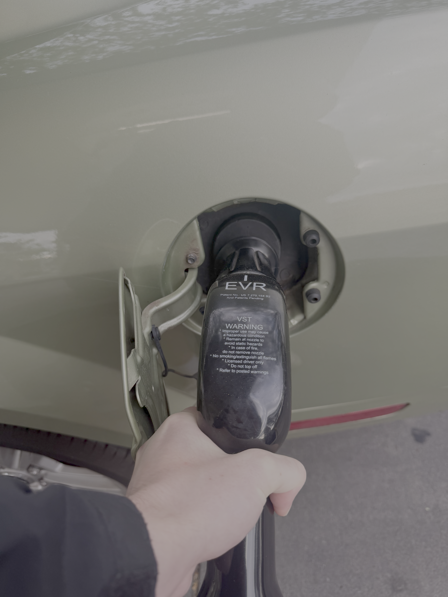
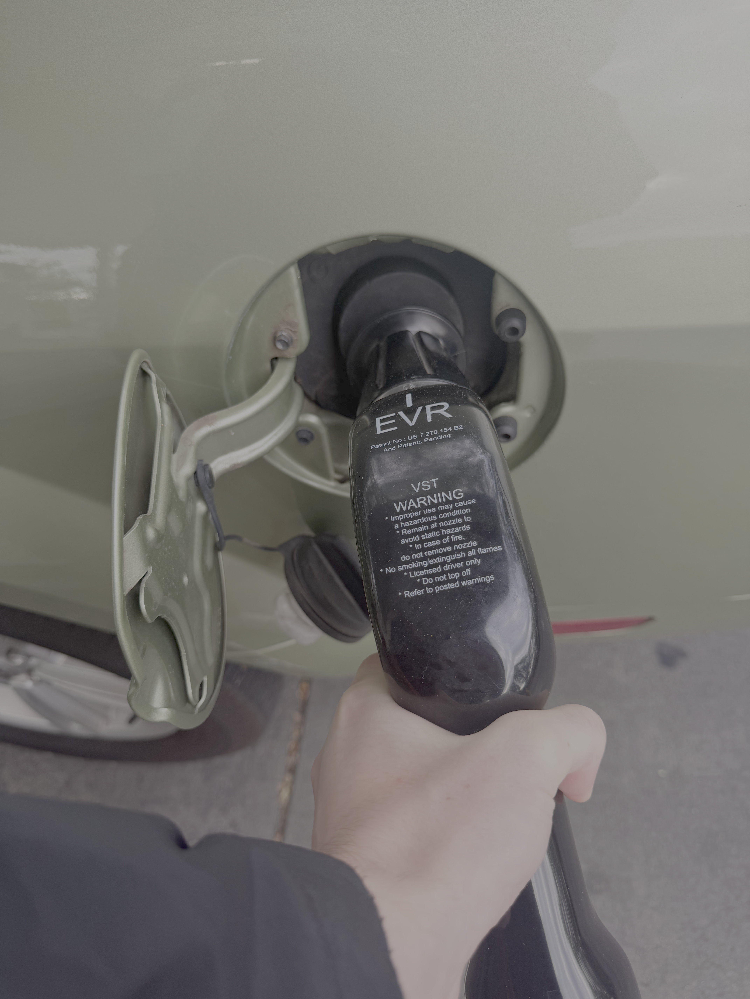
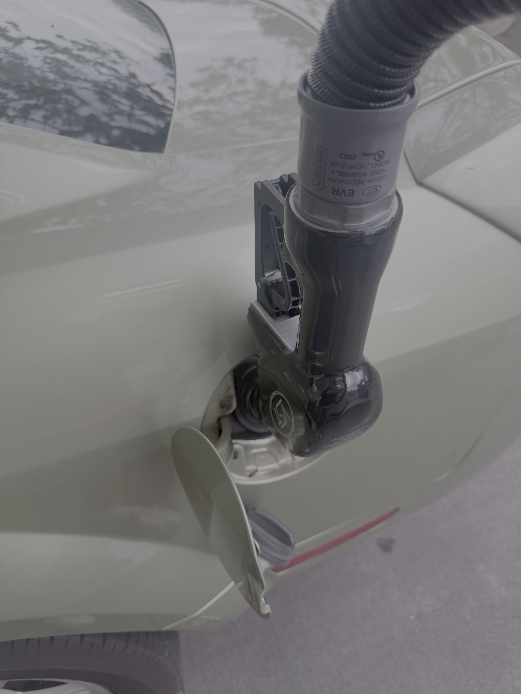

# Gas Pump Thinks My Car Is Full

Over this past summer, I was getting ready one morning to head to my internship when I remembered that my car was extremely low on gas from the night before. I knew I would have to stop and fill up on the way if I wanted to make it there without any issues. Although I was running a little behind schedule, I figured I still had enough time to make a quick stop at a gas station. I grabbed the keys to my 2005 Ford Mustang and headed to the closest gas station on the way to work, expecting the stop to be quick and routine. 

When I arrived at the gas station, I pulled up to the pump, inserted my card, and selected which gas to use. I then inserted the nozzle into my car and pulled the handle back to start pumping. I locked the small clip under the handle into place so I wouldn’t have to hold it myself. Almost immediately after it started fueling, the pump shut off. I was confused since there was no way my tank was full in that amount of time, and when I looked at the pump screen, barely any gas had been pumped. I tried again, expecting it to continue pumping normally, but it shut off just as quickly. 

Since I was in a crunch for time, I began adjusting the angle of the nozzle and applying pressure with my hands to see if anything would keep the gas flowing. After a few minutes of trial and error, I finally discovered the right angle and pressure to maintain a steady flow of gas.

Eventually, I was able to get the tank filled, but the process was far from quick or easy. Luckily, I made it to work just in time, but the interaction caused unnecessary stress and wasted time for what should be a simple and common task.

This interaction stood out to me because it did not match my **mental model** of how a typical gas tank should function. Based on previous experience with other cars, I expected the pump to fill smoothly once the nozzle was inserted normally. Instead, the premature shutoff forced me to experiment with angles and pressure. This mismatch between my mental model and the system’s **conceptual model** caused confusion, wasted time, and frustration.

After dealing with this issue multiple times, I looked into it further and found that this is a known issue with some early 2005 Mustang models, with the recommended fix being a replacement of the gas tank. I also came across a workaround suggesting that **inserting the nozzle upside down** could prevent the pump from shutting off prematurely. When I tried this, it allowed the gas to flow normally, which further confirmed that the issue was related to the design of the tank rather than the pump itself.

Ford failed in the domain of **Error Prevention**, which aims to design systems that prevent problems before they occur. In this case, the gas tank’s shutoff mechanism was intended to prevent overfilling, but it triggered prematurely even when the tank was far from full. While I could recognize the error thanks to the pump’s click noise and display, I still had to rely on trial and error to complete the task.

Another relevant concept is **Match Between the System and the Real World**, which refers to how well a system aligns with users’ real-world expectations and experiences. Most people with prior experience filling up a car at the gas station would not expect that filling the tank requires inserting the nozzle upside down to reach its intended use.

The usability experience of Ford's gas tank design is not **effective**, because users cannot reliably fill it as expected at different gas stations. It is also not **efficient**, since completing the task requires extra time, effort, and workarounds that would be unnecessary in most other cars. I would also say the interaction is not **satisfactory**, because it leaves a negative impression, especially when users are in a hurry.

A more user-friendly design would ensure that the pump only shuts off when the tank is truly full, eliminating the need for workarounds and making the experience consistent, reliable, and simple.
